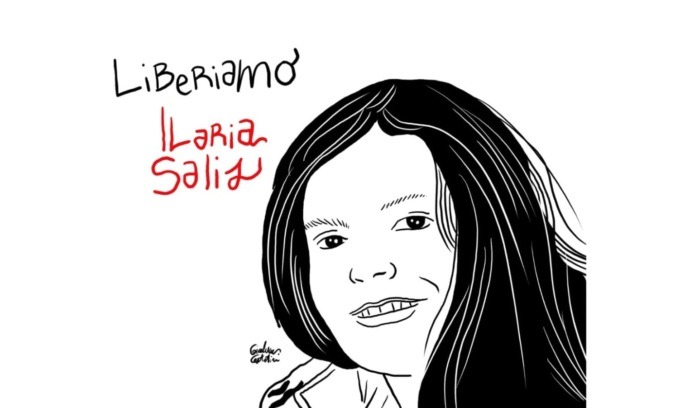

Hi! I am a mathematical logician, currently working as a postdoc at the [Turin Logic Group](https://www.logicgroup.altervista.org/torino/index.php?lng=eng). Beforehand, I obtained a PhD in Mathematics from the University of Helsinki under the main supervision of [Fan Yang](https://sites.google.com/site/fanyanghp/).

My main research interests are in model theory and (universal) algebra. My recent preprints are available in [arXiv](https://arxiv.org/search/?searchtype=author&query=Quadrellaro%2C+D+E) and my published work is generally listed in [zbMath](https://zbmath.org/authors/quadrellaro.davide-emilio).  My Orcid ID is [0000-0002-3750-3627](https://orcid.org/0000-0002-3750-3627). 

### Publications
#### Recent Works
- Tapani Hyttinen, Davide Emilio Quadrellaro. [Varieties of strictly n-generated Heyting algebras](https://arxiv.org/abs/2306.12250).
- Georgi Nakov, Davide Emilio Quadrellaro. [Algebraizable Weak Logics](https://arxiv.org/abs/2210.06047).

#### Journal Articles
0. Joni Puljujärvi, Davide Emilio Quadrellaro (2024). Compactness in Team Semantics. _Mathematical Logic Quarterly_, To Appear. ([arXiv preprint](https://arxiv.org/abs/2212.03677))
0. Gianluca Grilletti, Davide Emilio Quadrellaro (2024). [Esakia Duals of Regular Heyting Algebras](https://doi.org/10.1007/s00012-023-00833-5). _Algebra Universalis_, 85(5).
0. Davide Emilio Quadrellaro (2022). [On Intermediate Inquisitive and Dependence Logics: An Algebraic Study](https://www.sciencedirect.com/science/article/pii/S0168007222000586). _Annals of Pure and Applied Logic_, 173 (10):103143.
0. Nick Bezhanishvili, Gianluca Grilletti and Davide Emilio Quadrellaro (2022). [An Algebraic Approach to Inquisitive and DNA-Logics](https://www.doi.org/10.1017/S175502032100054X). _The Review of Symbolic Logic_, 15(4), 950-990. ([Helda preprint](https://researchportal.helsinki.fi/files/176225977/An_Algebraic_Approach_to_Inquisitive_and_DNA_Logics.pdf))
{: reversed="reversed"}

#### Conference Proceedings
0. Gianluca Grilletti, Davide Emilio Quadrellaro (2022). [Lattices of Intermediate Theories via Ruitenburg's Theorem](https://doi.org/10.1007/978-3-030-98479-3_15). In: Özgün, A., Zinova, Y. (eds) _Language, Logic, and Computation. TbiLLC 2019. Lecture Notes in Computer Science_, vol 13206, Springer, Cham. ([arXiv preprint](https://arxiv.org/abs/2004.00989))
{: reversed="reversed"}

#### Thesis and Student Papers
0. Davide Emilio Quadrellaro (2023). [Algebraic and Model-Theoretic Motifs in Team Semantics](https://helda.helsinki.fi/items/3119c988-de19-4076-b073-449571bab105). PhD Thesis, University of Helsinki.
0. Davide Emilio Quadrellaro (2019). [Lattices of DNA-Logics and Algebraic Semantics of Inquisitive Logic](https://eprints.illc.uva.nl/1722/1/MoL-2019-25.text.pdf). MSc Thesis, University of Amsterdam. (Awarded AILA’s [Best Thesis in Logic Prize](https://www.ailalogica.it/premi/premio-32) in 2020)
0. Davide Emilio Quadrellaro (2016). [Epistemic Logic and the Problem of Epistemic Closure](https://riviste.unimi.it/index.php/rifanalitica/article/view/11089). _Rivista Italiana di Filosofia Analitica Junior_, 7.2.
0. Davide Emilio Quadrellaro (2016). [Frege e Husserl: un confronto fra due teorie del significato](https://riviste.unimi.it/index.php/rifanalitica/article/view/7114). _Rivista Italiana di Filosofia Analitica Junior_, 7.1.
{: reversed="reversed"}

 

 
